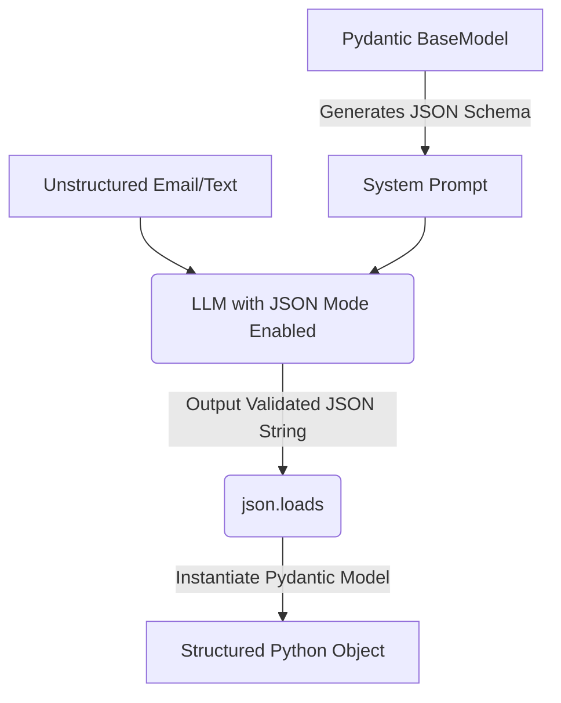

# 5: Structured Outputs (Pydantic + JSON Mode)

---

## 📖 Conceptual Explanations

### 1. The Core Problem: Unstructured Outputs in Production
When developers build simple prototypes or experiment with chat interfaces (like ChatGPT), they are comfortable receiving conversational, unstructured text responses (e.g., *"Sure! Here is the user information: the name is..."*). This is ideal for human consumption because humans can easily read and interpret natural language.

However, in **production systems**, the output of an AI agent is typically consumed by **other programs/code blocks** (written in Python, JavaScript, Java, C++, Go, etc.) rather than a human reviewer. 
* **The parsing nightmare:** Writing algorithms (using regular expressions or string matching) to parse unstructured English text is highly fragile, error-prone, and represents a historically difficult problem in computer science. If the LLM makes minor changes to its conversational formatting (such as adding extra markdown stars or introductory sentences), the parser will crash.
* **The scale challenge:** A production-level AI pipeline may process millions of queries daily. Because humans cannot possibly read and manually input these outputs, the LLM must return data in a structure that machines can read instantly and natively.

### 2. The Solution: JSON and Pydantic validation
To establish reliable machine-to-machine communication, we require a standardized data structure:

* **JSON (JavaScript Object Notation):** A lightweight, universal data-interchange format. It organizes data into key-value pairs (inside curly brackets `{}`), which can be parsed by almost every programming language in a single line of code (e.g., `data["email"]`).
* **Pydantic Validation:** Pydantic is a data validation library for Python. It allows developers to define a "schema contract" (a class inheriting from `BaseModel`). The library ensures that the data returned by the LLM strictly conforms to the exact types specified (e.g., matching a string, integer, or list) and handles validation errors gracefully.

---

## 🛠️ Setup & Installation

### 1. Prerequisites
Ensure you have Python 3.11+ installed. We recommend using `uv` or `pip` to manage dependencies.

### 2. Install Dependencies
Initialize your environment and install the required libraries:
```bash
# Install packages using uv (recommended)
uv add groq pydantic python-dotenv

# Or using pip
pip install groq pydantic python-dotenv
```


## 💡 Core Architecture Flow



---

## 💻 Code Example & Code Walkthrough

Below is a complete implementation of extracting user details from a customer complaint ticket and ignoring irrelevant text.

### Code Walkthrough
1. **Model Definition:** The `Ticket` class inherits from Pydantic's `BaseModel`. This serves as our schema contract, dictating that we only want three variables: `name`, `email`, and `issue`.
2. **Schema Export:** `Ticket.model_json_schema()` converts the Python structure into a standard JSON schema.
3. **Prompt Injection:** The system prompt receives the schema directly, instructing the LLM to format its response according to this definition.
4. **JSON Mode Parameter:** Setting `response_format={"type": "json_object"}` in the API call forces the LLM to output valid JSON.
5. **Loading and Validating:** `json.loads` converts the raw string response into a Python dictionary. Unpacking this dictionary into the model (`Ticket(**data)`) validates the types and fields, turning the raw response into a structured Python object.


## ⚠️ Common Gotchas & Troubleshooting

### 1. `AttributeError: 'Ticket' has no attribute 'model_json_schema'`
* **Explanation:** Your Pydantic model class was defined as a standard Python class and does not inherit from Pydantic's `BaseModel`. As a result, Pydantic's validation engine and schema generation methods are unavailable.
* **Fix:** Change `class Ticket:` to `class Ticket(BaseModel):`.

### 2. API Error demanding the word 'json' in messages
* **Explanation:** When specifying `response_format={"type": "json_object"}` in Groq or OpenAI completions, the API endpoint checks the messages array to confirm that you have instructed the LLM to output JSON. If the word "json" or "JSON" is missing from the prompts, the API rejects the request to prevent generation failure.
* **Fix:** Ensure you write *"return/output a JSON object"* inside your system prompt or user query.

