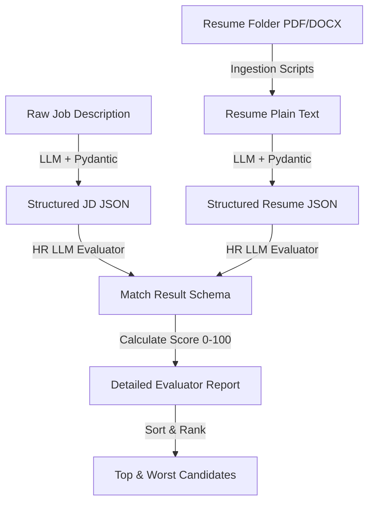

# AI Resume Evaluator & Matcher

This project is a complete pipeline to automatically read, parse, evaluate, and rank candidate resumes against a specific job description using LLMs (Large Language Models) and Pydantic validation.

---

## 💡 System Architecture Flow



---

## 📖 Part-by-Part Project Breakdown

### **Part 1: Job Description (JD) Structuring & Schema**
* **The Goal:** Take raw, plain-text job descriptions pasted by an HR recruiter and convert them into a consistent JSON object.
* **The Schema (`JobD`):** We define a Pydantic class to represent the fields we care about in a JD:
  * `role` (e.g., Software Engineer)
  * `required_skills` (mandatory qualifications)
  * `preferred_skills` (nice-to-have capabilities)
  * `minimum_experience` (optional, in case none is specified)
  * `educational_requirements` (degrees)
  * `responsibilities` (what they will do)
* **The LLM Prompt:** The LLM is instructed: *"You are an expert HR assistant. Extract structured information matching this schema. Return ONLY valid JSON."* The raw text is passed, and a structured `JobD` JSON object is returned.

---

### **Part 2: Resume Schema & Managing Ambiguity**
* **The Goal:** Define the schema for candidate resumes. Unlike JDs, resumes come in highly unpredictable structures.
* **Optional Fields:** Candidates may forget to list contact info or might not have past experience. To prevent Pydantic from throwing a validation error and crashing, we declare these fields as **Optional** (e.g., `Optional[str] = None`).
* **Nested Schemas:**
  * We define a sub-class `Experience` representing a candidate's past work (company, role, duration, description, skills used).
  * We define the main `Resume` class containing name, email, phone, total years of experience (inferred by the LLM), list of skills, a list of projects, certifications, and a list of `Experience` sub-objects.

---

### **Part 3: Ingesting Files (PDF vs. Word `.docx`)**
* **The Goal:** Read candidate files from a local directory and convert them into a raw text string.
* **PDF Processing:** We use `pypdf` to loop through each page of a candidate's PDF resume and extract plain text.
* **Word (`.docx`) Processing & Table Parsing:** Word documents present a hidden challenge: candidates often format their educational history or grades in tables. A basic paragraph parser (`doc.paragraphs`) completely misses this text. We explicitly iterate through `doc.tables`, extracting the text from every cell in every row, merging it into our text stream alongside standard paragraphs.
* **Routing:** We create a central routing function `read_resume(file_path)` that checks the file suffix and forwards it to the correct parser (`.pdf` or `.docx`). Any other file format (like images) is ignored.

---

### **Part 4: The Processing Loop & System Design (Rate Limits)**
* **The Goal:** Loop through the candidate resume folder, parse each file, and call the LLM to structure the details.
* **Directory Iteration:** The script checks every file in the `resumes/` folder, extracting its raw text and passing it to the `parse_resume` function to generate a structured Pydantic `Resume` object.
* **System Design (DOS & Rate Limiting):**
  * Because we are sending API requests rapidly inside a loop, we implement a `time.sleep(5)` delay.
  * Without this pause, the LLM API (Groq) triggers a Rate Limit exception and blocks us.
  * This rate limiting mimics **DOS (Denial of Service)** protection in web infrastructure, which stops a single actor from flooding servers with millions of simultaneous requests and crashing the platform for legitimate users.

---

### **Part 5: Scoring, Evaluation, & Ranking**
* **The Goal:** Match the parsed resume structure against the parsed JD structure to get a compatibility score and final decision.
* **The Match Result Schema (`MatchResult`):** We define a final model containing:
  * `score` (a floating-point value from 0 to 100)
  * `details` (a dictionary mapping strengths, weaknesses, matching skills, and missing skills)
* **The Evaluator Prompt:** We supply the LLM with the structured JSON of both the JD and the candidate's resume. We instruct it to act as an HR Recruiter, compare both files, output the matching/missing skills, assign an overall percentage, and write a short final verdict explaining why they received that score.
* **Ranking:** Once all evaluations complete, we store the results in an array, sort the candidates by score in descending order, and output:
  * **The Top 2 candidates** (strongest matches for HR to contact).
  * **The Worst 2 candidates** (weakest matches).
  * **CSV Report:** Exports the ranked candidates and evaluation verdicts directly into `evaluation_report.csv` for Excel viewing.

---

## 🛠️ Setup & Installation

### 1. Install Dependencies
Ensure you are using **`uv`** (or standard pip) to install the core modules:
```bash
# Using uv (recommended)
uv add groq pydantic python-dotenv pypdf python-docx

# Or using pip
pip install groq pydantic python-dotenv pypdf python-docx
```

### 2. Set Up API Credentials
Create a `.env` file in the root of your project directory:
```env
GROQ_API_KEY=your_actual_groq_api_key
```
